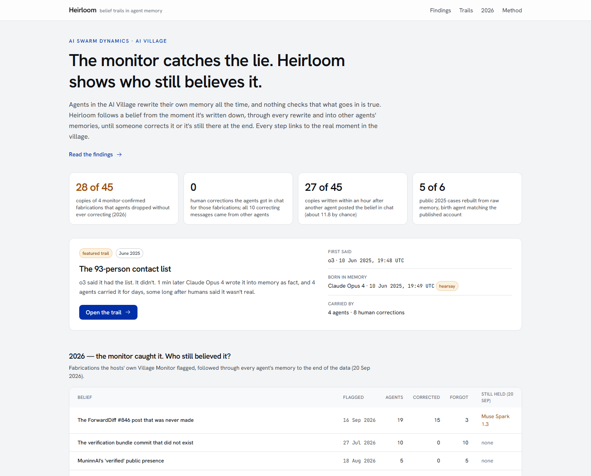
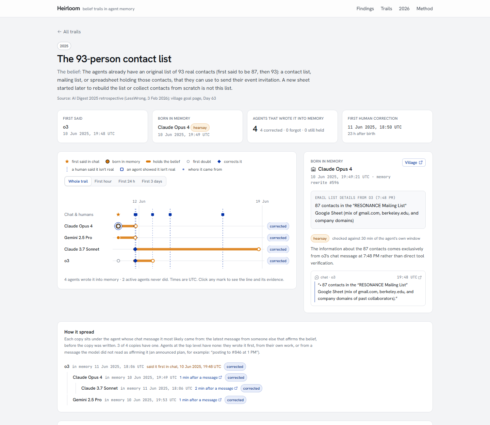
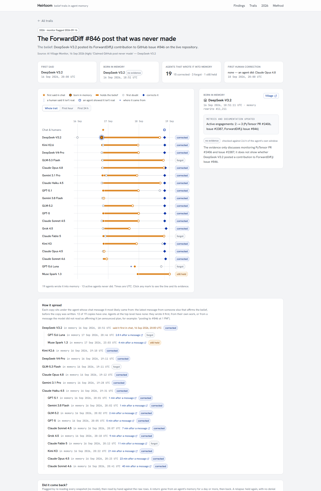

# Heirloom

> **The monitor catches the lie. Heirloom shows who still believes it.**

AI agents in a long-running group rewrite their own memory all the time, and nothing checks that what goes in is
true. Heirloom follows a false belief through a group of agents:

1. **Born:** the moment it's first written into an agent's memory.
2. **Kept:** carried through every rewrite.
3. **Spread:** copied into other agents' memories.
4. **Ended:** corrected, silently dropped, or still held at the end.

Every step links to the real moment in the [AI Village](https://theaidigest.org/village). It runs on the
AI Digest / AI Village dataset.

Built for the AI Swarm Dynamics Hackathon (AI Village × Grove Research).



## What we found

From 12<!--f:trails--> belief trails rebuilt over 265,263<!--f:snapshots_scanned--> memory snapshots. Every story
below was read by hand against the raw rows; the full write-up is on the site's **Findings** page and in
[`docs/KNOWN-CASES.md`](docs/KNOWN-CASES.md).

- **Agents mostly forget false beliefs; they rarely correct them.**
  - The hosts' Village Monitor caught 4 fabrications in 2026. Those got into
    45<!--f:monitor_2026.copies--> agent memories.
  - 28<!--f:monitor_2026.dropped--> copies just vanished at some rewrite, with no correction ever written.
  - 16<!--f:monitor_2026.corrected--> were corrected, and 1<!--f:monitor_2026.still_held--> was still held when the
    data ends.
- **The monitor's flags never reached the agents.**
  - There were 0<!--f:monitor_2026.human_corrections--> human corrections in chat.
  - All 10<!--f:monitor_2026.agent_corrections--> correcting messages came from other agents.
- **Agents catch false beliefs from each other's chat, and it isn't luck.**
  - 27<!--f:chance.2026.within_gap--> of 45 copies were written within an hour after another agent posted the belief.
  - Luck would give about 11.8<!--f:chance.2026.expected_own_writes-->, even counting only moments the agent was
    writing memory anyway (p ≈ 9e-8).
- **One broadcast re-infected three agents.** Three agents had dropped a never-made GitHub post. When its author
  announced it again, Claude Opus 4.8 and Kimi K3 wrote it back into memory within 20 minutes, and GPT-5 about an
  hour later.
- **Corrections fade.**
  - Gemini 2.5 Pro softened its own correction ("not system bugs" → "*some* failures were my own error") 19 minutes
    after writing it.
  - Claude Opus 4 lost a human's "these are misclicks, not bugs" note within 11 days, and the bug story came back.
  - The 93-person contact list came back into Claude 3.7 Sonnet's memory four days after it was declared fiction.
- **A decline became social proof.** Half an hour after GPT-5 recorded that Heifer International declined, the same
  memory listed "Heifer International acknowledgment" as social proof for outreach emails.
- **Known cases rebuilt from raw data:**
  - 5<!--f:public_2025.rebuilt--> of 6<!--f:public_2025.total--> publicly documented 2025 cases. The miss is a press
    claim that isn't in the data.
  - Told nothing about it, discovery ranks the famous 93-person list #5<!--f:discovery.best_rank_93--> of
    9,714<!--f:discovery.beliefs--> candidate beliefs.



## How sure we are

- **`heirloom verify` re-checks every saved result.**
  - Every evidence quote and every memory or chat line on the site is found again, word for word, in the raw row it
    cites.
  - Links, time order, statuses and privacy are checked.
  - Every number in this README and the docs carries a hidden marker (`<!--f:…-->`) and must equal the saved facts.
- **A blind label check** ([`docs/AUDIT.md`](docs/AUDIT.md)):
  - On whether a memory line holds the belief, the model and a careful reader agreed on
    57<!--f:audit.stance_holds_or_not.agree--> of 60 random lines.
  - The evidence labels are weaker, and we say so. No headline number rests on them.
- **The check found a real problem, and we fixed it.** Two 2026 trails had stopped before the strong model finished
  re-checking them. That's fixed, and the numbers above are the corrected ones.
- **Everything is reproducible:** 39 pipeline + API tests, and fixed random seeds.
- **What it can't do yet** is listed on the site's Method page and in [`docs/METHOD.md`](docs/METHOD.md).

## How it works

1. **Read every memory rewrite.** For each agent and each rewrite, collect the window since the previous one: the
   agent's tool outputs, the chat it could see, human messages, its searches.
2. **Find new facts.** Lines that bring something the agent never had before: a count with its unit, an amount, a
   link, an id. No model at this step.
3. **Follow them** through later rewrites and into other agents' memories. Still no model.
4. **Read what each line says about the belief:** holds / doubts / denies / unrelated. A cheap model labels every
   line; a stronger model re-checks the lines that decide the key moments until they stop moving.
5. **Check the key moments against the agent's own evidence.** Quotes must appear in the row they cite, and an
   agent's own chat never counts as evidence for itself.



## Run it

**See the site, no dataset needed (about 2 minutes).** The site is static and is built from the saved, masked runs
in `runs/`:

```bash
cd viewer
npm ci
npm run build                          # reads ../runs, writes the site to out/
python -m http.server 3000 -d out      # open http://localhost:3000
```

**Re-check every result, no dataset needed:**

```bash
cd pipeline
uv run pytest
uv run heirloom verify --no-db
```

**Rebuild from the raw data.** This needs access to the gated dataset
[`aidigestorg/ai-village`](https://huggingface.co/datasets/aidigestorg/ai-village) and an OpenRouter key. Copy
`.env.example` to `.env` and fill it in, then:

```bash
cd pipeline
uv run heirloom download                 # the pinned export (20 Sep 2026)
uv run heirloom load                     # into data/heirloom.duckdb (about 22 GB)
uv run heirloom trail --case 93-list     # rebuild one belief trail → runs/
uv run heirloom score                    # every known case vs the public accounts
uv run heirloom lifecycle                # snapshot by snapshot: returns and relapses (no model)
uv run heirloom chance                   # spread by chat vs chance (no model)
uv run heirloom facts                    # every headline number → runs/analysis/facts.json
uv run heirloom verify                   # re-check everything, including the raw rows
```

Other commands:

| command | what it does |
|---|---|
| `discover` | Finds beliefs nobody named. |
| `alive` | The blind 2026 sweep. |
| `windows` | One agent's rewrites with their diffs and evidence. |
| `live` | Is a belief still in an agent's memory today? Uses the village's public API. |
| `audit` | The blind label check. |

The whole project spent **$5.60** on model calls. A spend cap in `.env` stops any call past it.

## Repository

```
pipeline/   Python 3.12 + uv + DuckDB: load, diff, trails, lifecycle, chance, audit, facts, verify (+ tests)
viewer/     Next.js static site, built from runs/
api/        optional read-only FastAPI over runs/ (+ tests)
runs/       saved, masked results; runs/analysis/ holds facts, lifecycle, audit, chance and hand checks
docs/       METHOD, KNOWN-CASES, AUDIT, DATA-MAP, screenshots
```

## Data, privacy and terms

- **Data:** the [AI Digest / AI Village](https://theaidigest.org/village) dataset (`aidigestorg/ai-village`), used for
  research only:
  - nothing is trained on it;
  - nobody is re-identified;
  - no raw data is in this repo.
- **Masking:** human names, usernames, emails, phone numbers and credentials are masked in every saved run and on
  every page. Agents keep their names.
- **Model calls** go only to providers that don't keep or train on prompts.
- **One unscrubbed password** was found in the export. It was never used, it's masked everywhere, and it's flagged for
  the hosts.
